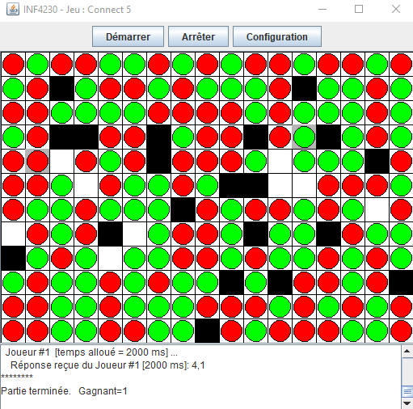

# Minimax algorithm  - Connect5

## Context 

Implementation of [Minimax algorithm](https://en.wikipedia.org/wiki/Minimax) for a [Connect5/Gomoku game](https://en.wikipedia.org/wiki/Gomoku) in Java for [IA class @ UQAM](https://etudier.uqam.ca/cours?sigle=INF4230).

## Example of execution

Final result of a game with 2000ms for each player.

## Project structure

Code is situated in 2 .class file : 

- [Etat.class](planeteH_2/Etat.class)
- [Intervalle.class](planeteH_2/Intervalle.class)

